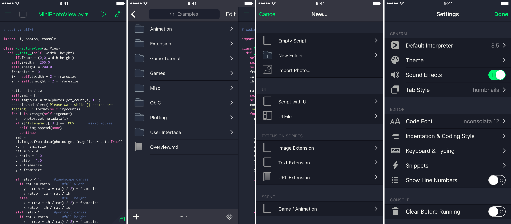

# Dracula for [Pythonista](http://omz-software.com/pythonista/)

> A dark theme for [Pythonista](http://omz-software.com/pythonista/).

## Install

All instructions can be found at [draculatheme.com/pythonista](https://draculatheme.com/pythonista).

## Community

- [Twitter](https://twitter.com/draculatheme) - Best for getting updates about themes and new stuff.
- [GitHub](https://github.com/dracula/dracula-theme/discussions) - Best for asking questions and discussing issues.
- [Discord](https://draculatheme.com/discord-invite) - Best for hanging out with the community.

## License

[MIT License](./LICENSE)
